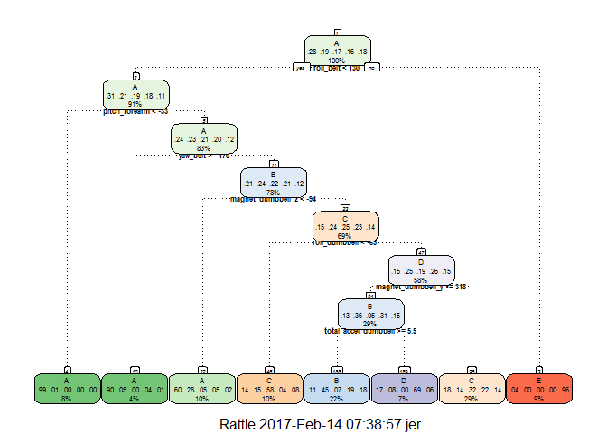
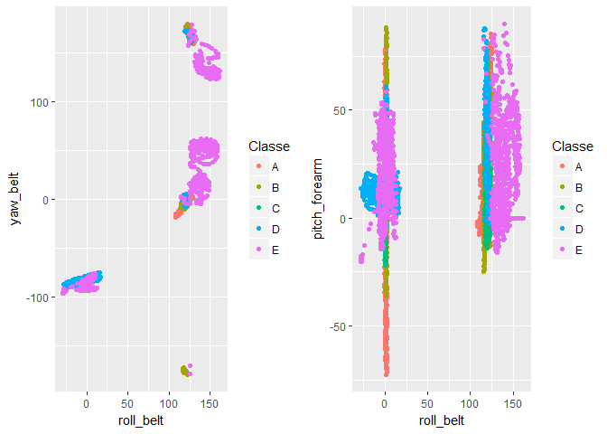

# Practical Machine Learning Project
JE Ridley [GitHub](https://github.com/jeridley/PracticalMachineLearning)  

##Background

Using devices such as Jawbone Up, Nike FuelBand, and Fitbit it is now possible to collect a large amount of data about personal activity relatively inexpensively. These type of devices are part of the quantified self movement - a group of enthusiasts who take measurements about themselves regularly to improve their health, to find patterns in their behavior, or because they are tech geeks. One thing that people regularly do is quantify how much of a particular activity they do, but they rarely quantify how well they do it. In this project, your goal will be to use data from accelerometers on the belt, forearm, arm, and dumbell of 6 participants. They were asked to perform barbell lifts correctly and incorrectly in 5 different ways. More information is available from the website here: http://groupware.les.inf.puc-rio.br/har (see the section on the Weight Lifting Exercise Dataset). 

###Data

The training data for this project are available here:  
https://d396qusza40orc.cloudfront.net/predmachlearn/pml-training.csv

The test data are available here:  
https://d396qusza40orc.cloudfront.net/predmachlearn/pml-testing.csv

The data for this project come from this source: http://groupware.les.inf.puc-rio.br/har. If you use the document you create for this class for any purpose please cite them as they have been very generous in allowing their data to be used for this kind of assignment. 

###What you should submit

The goal of your project is to predict the manner in which they did the exercise. This is the "classe" variable in the training set. You may use any of the other variables to predict with. You should create a report describing how you built your model, how you used cross validation, what you think the expected out of sample error is, and why you made the choices you did. You will also use your prediction model to predict 20 different test cases. 

**Peer Review Portion**  
Your submission for the Peer Review portion should consist of a link to a Github repo with your R markdown and compiled HTML file describing your analysis. Please constrain the text of the writeup to < 2000 words and the number of figures to be less than 5. It will make it easier for the graders if you submit a repo with a gh-pages branch so the HTML page can be viewed online (and you always want to make it easy on graders  
:-).

**Course Project Prediction Quiz Portion**  
Apply your machine learning algorithm to the 20 test cases available in the test data above and submit your predictions in appropriate format to the Course Project Prediction Quiz for automated grading.


###Reproducibility

Due to security concerns with the exchange of R code, your code will not be run during the evaluation by your classmates. Please be sure that if they download the repo, they will be able to view the compiled HTML version of your analysis. 


###Prepare the datasets

Load libraries.

```r
library(caret)
library(rpart)
library(rpart.plot)
library(knitr)
library(gridExtra)
library(rattle)
library(randomForest)
```

Load the training data into a data table.

```r
origTrainingData <- read.table("./data/pml-training.csv", header = TRUE, sep = ",")
origTestingData <- read.table("./data/pml-testing.csv", header = TRUE, sep = ",")
```

###Clean the data  
The data provided variables with missing data, datanot relevant to the question being analyzed. The data was cleaned,extracting relevant variables by using pattern recognition for relevant strings. 52 variables remain.  


Clean the columns of the training data

```r
trainingClean <- cbind((origTrainingData[, grepl("^accel", names(origTrainingData))]), 
    (origTrainingData[, grepl("^roll", names(origTrainingData))]), (origTrainingData[, 
        grepl("^pitch", names(origTrainingData))]), (origTrainingData[, grepl("^yaw", 
        names(origTrainingData))]), (origTrainingData[, grepl("^magnet", names(origTrainingData))]), 
    (origTrainingData[, grepl("^gyro", names(origTrainingData))]), (origTrainingData[, 
        grepl("^total", names(origTrainingData))]), origTrainingData[, 160])
colnames(trainingClean)[53] <- "Classe"
```

Clean the columns of the testing data

```r
testingClean <- cbind((origTestingData[, grepl("^accel", names(origTestingData))]), 
    (origTestingData[, grepl("^roll", names(origTestingData))]), (origTestingData[, 
        grepl("^pitch", names(origTestingData))]), (origTestingData[, grepl("^yaw", 
        names(origTestingData))]), (origTestingData[, grepl("^magnet", names(origTestingData))]), 
    (origTestingData[, grepl("^gyro", names(origTestingData))]), (origTestingData[, 
        grepl("^total", names(origTestingData))]), origTestingData[, 160])
colnames(testingClean)[53] <- "Classe"
```

Create 2 partitons of the training data. 60% for training and 40% for testing. 

```r
set.seed(1000)
inTraining = createDataPartition(trainingClean$Classe, p = 0.6)[[1]]
trainingData = trainingClean[inTraining, ]
testingData = trainingClean[-inTraining, ]
```
###Testing Model
The outcomes are categorical. The method rpart was used to test a decision tree model.

```r
set.seed(1000)
modFit <- train(Classe ~ ., method = "rpart", data = trainingData)
print(modFit$finalModel)
```

```
## n= 11776 
## 
## node), split, n, loss, yval, (yprob)
##       * denotes terminal node
## 
##   1) root 11776 8428 A (0.28 0.19 0.17 0.16 0.18)  
##     2) roll_belt< 129.5 10707 7401 A (0.31 0.21 0.19 0.18 0.11)  
##       4) pitch_forearm< -33.15 961    9 A (0.99 0.0094 0 0 0) *
##       5) pitch_forearm>=-33.15 9746 7392 A (0.24 0.23 0.21 0.2 0.12)  
##        10) yaw_belt>=169.5 504   52 A (0.9 0.054 0 0.042 0.0079) *
##        11) yaw_belt< 169.5 9242 6999 B (0.21 0.24 0.22 0.21 0.12)  
##          22) magnet_dumbbell_z< -93.5 1128  456 A (0.6 0.28 0.051 0.051 0.023) *
##          23) magnet_dumbbell_z>=-93.5 8114 6117 C (0.15 0.24 0.25 0.23 0.14)  
##            46) roll_dumbbell< -64.76216 1234  513 C (0.14 0.15 0.58 0.04 0.077) *
##            47) roll_dumbbell>=-64.76216 6880 5078 D (0.15 0.25 0.19 0.26 0.15)  
##              94) magnet_dumbbell_y>=317.5 3430 2184 B (0.13 0.36 0.053 0.31 0.15)  
##               188) total_accel_dumbbell>=5.5 2637 1452 B (0.11 0.45 0.068 0.19 0.18) *
##               189) total_accel_dumbbell< 5.5 793  246 D (0.17 0.077 0.0013 0.69 0.061) *
##              95) magnet_dumbbell_y< 317.5 3450 2355 C (0.18 0.14 0.32 0.22 0.14) *
##     3) roll_belt>=129.5 1069   42 E (0.039 0 0 0 0.96) *
```

```r
fancyRpartPlot(modFit$finalModel, cex = 0.5, under.cex = 1, shadow.offset = 0)
```

<!-- -->


```r
testingPrediction = predict(modFit, testingData)
confusionMatrix(testingData$Classe, testingPrediction)
```

```
## Confusion Matrix and Statistics
## 
##           Reference
## Prediction    A    B    C    D    E
##          A 1330  196  563  111   32
##          B  239  767  463   49    0
##          C   32  113 1223    0    0
##          D   73  343  529  341    0
##          E   17  331  394   28  672
## 
## Overall Statistics
##                                           
##                Accuracy : 0.5523          
##                  95% CI : (0.5412, 0.5633)
##     No Information Rate : 0.4043          
##     P-Value [Acc > NIR] : < 2.2e-16       
##                                           
##                   Kappa : 0.4386          
##  Mcnemar's Test P-Value : < 2.2e-16       
## 
## Statistics by Class:
## 
##                      Class: A Class: B Class: C Class: D Class: E
## Sensitivity            0.7865  0.43829   0.3856  0.64461  0.95455
## Specificity            0.8535  0.87680   0.9690  0.87085  0.89219
## Pos Pred Value         0.5959  0.50527   0.8940  0.26516  0.46602
## Neg Pred Value         0.9357  0.84466   0.6991  0.97134  0.99500
## Prevalence             0.2155  0.22304   0.4043  0.06742  0.08973
## Detection Rate         0.1695  0.09776   0.1559  0.04346  0.08565
## Detection Prevalence   0.2845  0.19347   0.1744  0.16391  0.18379
## Balanced Accuracy      0.8200  0.65755   0.6773  0.75773  0.92337
```

The outcomes are not as definitive as exepected in viewing the plot. In testing this model on the testing data, it is revealed to have a 54.6% accuracy, only slightly better than chance. The variables used in the algorithm include roll_belt, pitch_forearm, yaw_belt,magnet_dumbbell_Z,pitch_belt, and magnet_dumbell_x. The model is the least accurate for outcome D.

###Using the Random Forest Model
Since the rpart model was inaccurate and the outcome the rpart tree demonstrates more nuances in variable selection, a "random forest" model was tested to see if that method fit the data more appropriately.

```r
set.seed(1000)
modFit2 <- train(Classe ~ ., method = "rf", trControl = trainControl(method = "cv", 
    number = 4), data = trainingData)
```

```r
print(modFit2)
```

```
## Random Forest 
## 
## 11776 samples
##    52 predictor
##     5 classes: 'A', 'B', 'C', 'D', 'E' 
## 
## No pre-processing
## Resampling: Cross-Validated (4 fold) 
## Summary of sample sizes: 8832, 8833, 8832, 8831 
## Resampling results across tuning parameters:
## 
##   mtry  Accuracy   Kappa    
##    2    0.9884510  0.9853886
##   27    0.9898944  0.9872158
##   52    0.9864130  0.9828121
## 
## Accuracy was used to select the optimal model using  the largest value.
## The final value used for the model was mtry = 27.
```

```r
varImp(modFit2)
```

```
## rf variable importance
## 
##   only 20 most important variables shown (out of 52)
## 
##                      Overall
## roll_belt            100.000
## pitch_forearm         59.012
## yaw_belt              55.225
## magnet_dumbbell_z     42.714
## magnet_dumbbell_y     42.073
## pitch_belt            41.680
## roll_forearm          41.270
## accel_dumbbell_y      22.763
## accel_forearm_x       19.273
## magnet_dumbbell_x     17.473
## roll_dumbbell         16.748
## magnet_belt_z         15.790
## accel_belt_z          14.871
## total_accel_dumbbell  14.422
## accel_dumbbell_z      13.712
## magnet_forearm_z      12.788
## magnet_belt_y         12.360
## gyros_belt_z          10.881
## yaw_arm               10.225
## magnet_belt_x          9.316
```

```r
testingPrediction2 = predict(modFit2, testingData)
confusionMatrix(testingData$Classe, testingPrediction2)
```

```
## Confusion Matrix and Statistics
## 
##           Reference
## Prediction    A    B    C    D    E
##          A 2230    2    0    0    0
##          B   23 1493    2    0    0
##          C    0    9 1354    5    0
##          D    0    1   23 1262    0
##          E    0    4    2    3 1433
## 
## Overall Statistics
##                                           
##                Accuracy : 0.9906          
##                  95% CI : (0.9882, 0.9926)
##     No Information Rate : 0.2872          
##     P-Value [Acc > NIR] : < 2.2e-16       
##                                           
##                   Kappa : 0.9881          
##  Mcnemar's Test P-Value : NA              
## 
## Statistics by Class:
## 
##                      Class: A Class: B Class: C Class: D Class: E
## Sensitivity            0.9898   0.9894   0.9804   0.9937   1.0000
## Specificity            0.9996   0.9961   0.9978   0.9964   0.9986
## Pos Pred Value         0.9991   0.9835   0.9898   0.9813   0.9938
## Neg Pred Value         0.9959   0.9975   0.9958   0.9988   1.0000
## Prevalence             0.2872   0.1923   0.1760   0.1619   0.1826
## Detection Rate         0.2842   0.1903   0.1726   0.1608   0.1826
## Detection Prevalence   0.2845   0.1935   0.1744   0.1639   0.1838
## Balanced Accuracy      0.9947   0.9927   0.9891   0.9950   0.9993
```

The random forest model has a 99.2% accuracy, much better to the rpart method. The specificity and sensitivity is in the high 90s for all variables. The top five variables of importance included the roll_belt, yaw_belt,magnet_dumbbell_z,magnet_dumbbell_y, and the pitch_forearm. For outcome C, the model is the least accurate. Preprocessing was considered, but at the risk of overfitting the model was not tested due to the accuracy already being over 99%.

Below are a few examples of how the data is more intricate than a discrete rpart model allow for, as it would require many yes/no statements to find all the different variations of each outcome.


```r
p1 <- qplot(roll_belt, yaw_belt, colour = Classe, data = trainingData)
p2 <- qplot(roll_belt, pitch_forearm, colour = Classe, data = trainingData)
grid.arrange(p1, p2, ncol = 2)
```

<!-- -->

```r
dev.off()
```

```
## null device 
##           1
```

###In-Sample & Out-of-Sample Error

The in-sample error is error rate when the model is used to predict the training data it is based off. This error is going to be much less than the out-of-sample error. For the random forest model used as the final algorithm, the in sample error rate is 0; the model is 100% accurate, but could be overfitting the data.


```r
testingPrediction3 = predict(modFit2, testingData)
confusionMatrix(testingData$Classe, testingPrediction3)
```

```
## Confusion Matrix and Statistics
## 
##           Reference
## Prediction    A    B    C    D    E
##          A 2230    2    0    0    0
##          B   23 1493    2    0    0
##          C    0    9 1354    5    0
##          D    0    1   23 1262    0
##          E    0    4    2    3 1433
## 
## Overall Statistics
##                                           
##                Accuracy : 0.9906          
##                  95% CI : (0.9882, 0.9926)
##     No Information Rate : 0.2872          
##     P-Value [Acc > NIR] : < 2.2e-16       
##                                           
##                   Kappa : 0.9881          
##  Mcnemar's Test P-Value : NA              
## 
## Statistics by Class:
## 
##                      Class: A Class: B Class: C Class: D Class: E
## Sensitivity            0.9898   0.9894   0.9804   0.9937   1.0000
## Specificity            0.9996   0.9961   0.9978   0.9964   0.9986
## Pos Pred Value         0.9991   0.9835   0.9898   0.9813   0.9938
## Neg Pred Value         0.9959   0.9975   0.9958   0.9988   1.0000
## Prevalence             0.2872   0.1923   0.1760   0.1619   0.1826
## Detection Rate         0.2842   0.1903   0.1726   0.1608   0.1826
## Detection Prevalence   0.2845   0.1935   0.1744   0.1639   0.1838
## Balanced Accuracy      0.9947   0.9927   0.9891   0.9950   0.9993
```

When the model is used on a separate data set the accuracy is still at 99.2%.

```r
testingPrediction4 = predict(modFit2, testingData)
confusionMatrix(testingData$Classe, testingPrediction4)
```

```
## Confusion Matrix and Statistics
## 
##           Reference
## Prediction    A    B    C    D    E
##          A 2230    2    0    0    0
##          B   23 1493    2    0    0
##          C    0    9 1354    5    0
##          D    0    2   23 1261    0
##          E    0    4    2    3 1433
## 
## Overall Statistics
##                                          
##                Accuracy : 0.9904         
##                  95% CI : (0.988, 0.9925)
##     No Information Rate : 0.2872         
##     P-Value [Acc > NIR] : < 2.2e-16      
##                                          
##                   Kappa : 0.9879         
##  Mcnemar's Test P-Value : NA             
## 
## Statistics by Class:
## 
##                      Class: A Class: B Class: C Class: D Class: E
## Sensitivity            0.9898   0.9887   0.9804   0.9937   1.0000
## Specificity            0.9996   0.9961   0.9978   0.9962   0.9986
## Pos Pred Value         0.9991   0.9835   0.9898   0.9806   0.9938
## Neg Pred Value         0.9959   0.9973   0.9958   0.9988   1.0000
## Prevalence             0.2872   0.1925   0.1760   0.1617   0.1826
## Detection Rate         0.2842   0.1903   0.1726   0.1607   0.1826
## Detection Prevalence   0.2845   0.1935   0.1744   0.1639   0.1838
## Balanced Accuracy      0.9947   0.9924   0.9891   0.9949   0.9993
```
And when used on the original testing data set, the submitted answer resulted in 100% correct. This may not indicate 100% accuracy as some problems may have had several solutions marked as correct to account for various algorithms. This testing on a new set of data gives more credence that the model accounts for the signal and not just the noise.


```r
testingAnswers = predict(modFit2, newdata = origTestingData)
print(testingAnswers)
```

```
##  [1] B A B A A E D B A A B C B A E E A B B B
## Levels: A B C D E
```

It is also important to consider that the samples are all taken from one larger sample and that if the data were to be collected again during a different time period or with different participants the out of sample error could be higher and the algorithm may not be as accurate. This is especially true when considering that though there are many observations, the data comes for 6 participants which may not be representative of the population as a whole.

###Conclusion
Random Forest was a better model for prediction of exercise quality compared to rpart. The nominal categories were dependent the interaction and quality of various variable. The random forest model had over 99% accuracy and fitted well to other subsamples of the data. The algorithm. however,  may not have as high of accuracy on other samples, particularly ones with different subjects.

In the first model D was the most difficult to predict and in the second C was the most difficult to predict. This makes theoretical sense as Class C is lifting the dumbbell only halfway and Class D is lowering the dumbbell only halfway. These movements may be hard to distinguish by the data collected and could be a topic for future research regarding how to detect this difference-if deemed important.

Overall, it is interesting to consider how monitors are affected by the quality of an exercise and are able to predict the error made. This is an important indicator for health and fitness as it is not just the quantity of exercise that can be collected and analyzed but also the quality.
